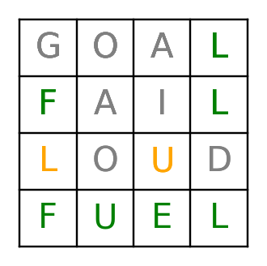

# Wordle in python

| Key               | Language         |
| ----------------- | ---------------- |
| [en](lang/en.txt) | English          |
| [es](lang/es.txt) | Spanish          |
| [an](lang/an.txt) | Anime            |
| [ch](lang/ch.txt) | Anime characters |
| [cs](lang/cs.txt) | Car brands       |

```py
LANGUAGES = {
    "en": "English",
    "es": "Spanish",
    "pk": "Pokemon",
    "an": "Anime",
    "ch": "Characters",
    "cs": "Cars"}
```

```
100 > rows, columns > 0
```


